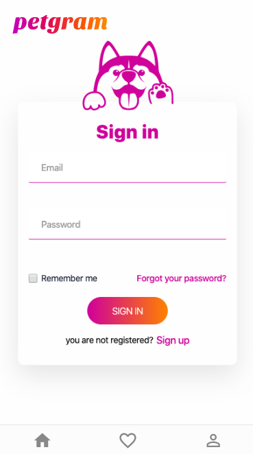

# ADVANCED REACT JS - PETGRAM PROJECT

## PETGRAM
	  
Please read instruction (to deploy backend and frontend with now)

    > Install NodeJs First

    > Then install  now with following command
      # npm i -g now

    > Create an account entering the following url: 
      https://zeit.co/

    > Finally run the following command in both the root directory and the /api directory

      # now

    > It will setup whole required architecture includes 

        > 1 App Frontend which has
            - nodejs server + source code

        > 1 App Backend which has
            - nodejs server + source code

> [Do you want to learn React Js?]</a> (Spanish). **All credits to the original author, [Miguel Durán]**

[Do you want to learn React Js?]: <https://platzi.com/clases/react-avanzado/>

[Jonas Schmedtmann]: <https://twitter.com/midudev>